# Shotten — frontend flow voor gewone spelers

Deze documentatie beschrijft de gebruikersflow van de Shotten PWA voor een gewone speler, uitsluitend vanuit frontend-oogpunt. De verborgen admin-flow is bewust niet opgenomen. De captures zijn gemaakt vanaf de actuele `main`-versie op branch `docs/non-admin-flow-screenshots`, in een production build met een viewport van **360 × 780 CSS-pixels** — het formaat dat voor deze Galaxy S25-capture wordt gebruikt.

De screenshots zijn op **30 augustus 2026** genomen met Tristan als geselecteerd profiel en met de toen beschikbare live wedstrijddata. Namen, tijden, standen en aantallen kunnen dus wijzigen wanneer de backenddata later verandert.

## Flow in één oogopslag

```text
Profiel kiezen
      ↓
Home / komende matchen
   ↙      ↓       ↘
Matchdetail  Notificaties  Recente matchen
      ↓
Squad ↔ Opponent

Home ↔ Stats ↔ League ↔ Settings
       ↓       ↓       ↓
  spelerdetail teamdetail instellingen & hulpschermen
```

De app bewaart het gekozen spelerprofiel lokaal op het toestel. Bij een volgend bezoek wordt de speler daardoor meteen naar de dashboardflow gebracht. De vier hoofdviews zijn horizontaal navigeerbaar door te swipen en zijn ook bereikbaar via de zwevende navigatie onderaan: **Home**, **Stats**, **League** en **Settings**.

## Belangrijk Home-aandachtspunt

Home moet voor spelers in één overzichtelijke pagina de volledige beschikbaarheid voor **alle opkomende matchen** tonen. De gebruiker moet zonder extra tikken, detailpagina’s of verborgen interacties meteen kunnen zien:

- wie **wel** kan;
- wie **niet** kan;
- wie **misschien** kan;
- wie nog niet heeft geantwoord / **TBD** is;
- hoeveel spelers er in elke categorie zitten, per opkomende match.

De huidige frontend toont die informatie al per matchkaart met de groepen `In`, `Maybe`, `Out` en `TBD`, maar de lijst met komende matchen loopt verticaal door. Voor de uiteindelijke Home-UX is het dus belangrijk dat dit overzicht compact, scanbaar en op één pagina blijft — zeker voor meerdere toekomstige matchen. De primaire actie van een speler moet vanuit die kaart duidelijk blijven: met één tik de eigen aanwezigheid op **Present**, **Maybe** of **NotPresent** zetten.

## Schermen en frontendgedrag

### 1. Profiel kiezen

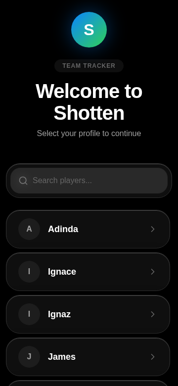

Het startscherm vraagt geen accountwachtwoord, maar laat de speler zijn profiel kiezen. De lijst bevat een avatar met initiaal, de naam en een chevron. Via `Search players...` kan de lijst direct worden gefilterd. Na het kiezen van een profiel wordt de selectie lokaal opgeslagen en opent het dashboard.

Frontendgedrag:

- loading state met skeleton-rijen zolang profielen worden opgehaald;
- zoekfilter werkt onmiddellijk op naam;
- een gekozen rij wordt tijdelijk gemarkeerd voordat de dashboardtransitie start;
- een niet-bestaande zoekopdracht toont `No players found`.

### 2. Home — Matches

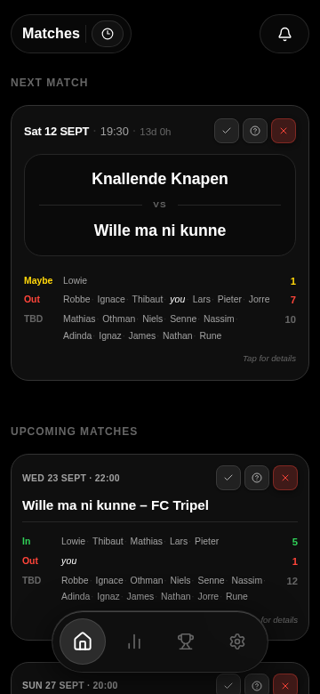

Home is de primaire werkruimte. Bovenaan staat de eerstvolgende match als `Next Match`. Daaronder staan alle andere toekomstige matchen in `Upcoming Matches`.

Op elke kaart staat frontendmatig:

- datum, uur en countdown tot de aftrap;
- beide teams en locatie-informatie wanneer beschikbaar;
- beschikbaarheid gegroepeerd in `In`, `Maybe`, `Out` en `TBD`;
- het aantal spelers per groep;
- de drie compacte antwoordknoppen voor aanwezig, misschien en afwezig;
- `Tap for details` om de volledige matchweergave te openen.

De kaart van de huidige speler is visueel herkenbaar. De eigen status kan direct op de kaart worden gewijzigd; de dashboardstaat wordt daarna optimistisch aangepast zodat de gebruiker niet op een volledige refresh hoeft te wachten. Pull-to-refresh kan de data opnieuw ophalen. De navigatiebalk blijft onderaan beschikbaar.

### 3. Recente matchen-sheet

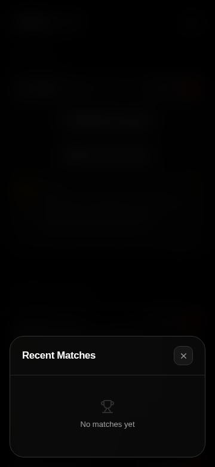

Via het klokje naast `Matches` opent een bottom sheet met recente uitslagen. De sheet dimt de Home-view, heeft een eigen sluitknop en toont maximaal de recente resultaten die beschikbaar zijn. Als er geen recente gegevens zijn, verschijnt de lege toestand `No matches yet`.

Dit is een informatieve overlay: de gebruiker kan de sheet sluiten en keert terug naar exact dezelfde positie op Home.

### 4. Notificaties-sheet

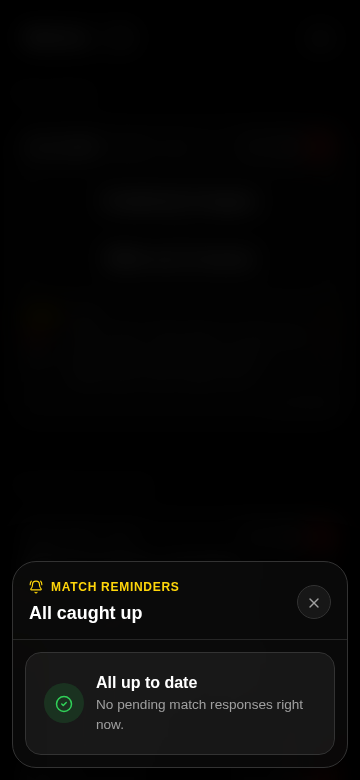

De bel rechtsboven opent `Match Reminders`. De frontend groepeert herinneringen voor onbeantwoorde aanwezigheden en kick-off alerts. Bij een lege lijst toont de sheet `All caught up` en `No pending match responses right now.`

Wanneer er wel reminders zijn, kan de gebruiker op een reminder tikken. De sheet sluit dan, Home wordt indien nodig geactiveerd en de relevante matchkaart wordt naar voren gescrold en kort gehighlight.

### 5. Matchdetail — Squad

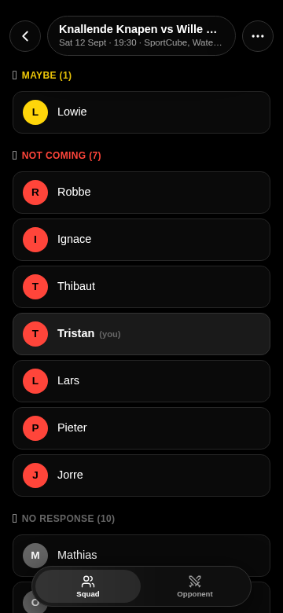

Een tik op een matchkaart opent een full-screen matchdetail. De bovenste glass header bevat een backknop, de matchnaam met datum/locatie en het `More`-menu. Onderaan staat een segment control met `Squad` en `Opponent`.

In `Squad` worden spelers per antwoordstatus gegroepeerd. De frontend maakt daardoor onmiddellijk zichtbaar:

- wie `Maybe` is;
- wie `Not coming` is;
- wie nog `No response` heeft;
- welke rij de huidige speler voorstelt.

Dit scherm is bedoeld voor snelle controle van de samenstelling. De backknop sluit het detail en brengt de gebruiker terug naar Home.

### 6. Matchdetail — Opponent

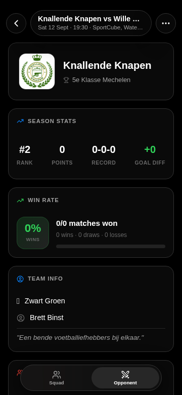

Via de tab `Opponent` schuift de matchdetail horizontaal naar de opponent-view. Daar staan, afhankelijk van de beschikbare wedstrijddata:

- logo en naam van de tegenstander;
- league/context van de tegenstander;
- seizoensstatistieken zoals rank, punten, record en doelsaldo;
- win rate en recente vorm;
- teaminformatie;
- een AI scouting card wanneer de analyse beschikbaar is.

De frontend voorziet ook een laad- en fouttoestand met `Try Again`. Dat is een schermstatus binnen dezelfde opponent-view, geen aparte navigatieroute.

### 7. Matchdetail — More-menu

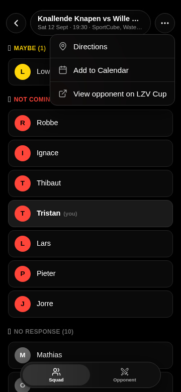

De `More`-knop in de matchdetail opent een compact contextmenu met:

- `Directions` voor de locatie;
- `Add to Calendar`;
- `View opponent on LZV Cup`.

Het menu sluit via de achtergrond of door opnieuw terug te gaan. De onderliggende squadweergave blijft behouden.

### 8. Stats — Leaderboard

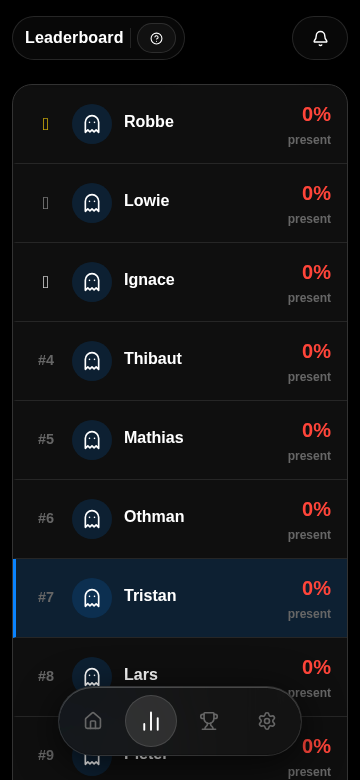

`Stats` toont een leaderboard met alle spelers, gesorteerd op attendance rate. Elke rij bevat de rang, avatar, spelernaam, percentage en ranklabel. De huidige speler krijgt een gekleurde accentstrook.

Een tik op een speler opent het volgende scherm, `Player detail`. De vraagtekenknop in de header opent de uitleg van de aanwezigheids- en ranksystematiek.

### 9. Player detail

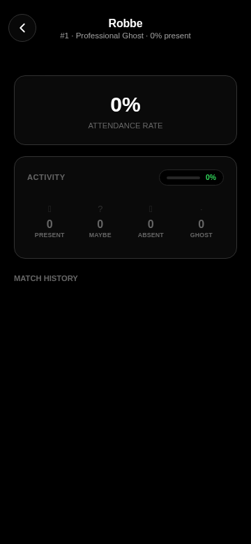

Het spelersdetail toont de individuele samenvatting:

- attendance rate;
- activity-verdeling over `Present`, `Maybe`, `Absent` en `Ghost`;
- match history;
- het berekende ranklabel.

De backknop brengt de gebruiker terug naar de leaderboardpositie. De inhoud is informatief; de attendance wordt aangepast via de matchkaart of via `Respond as Player`.

### 10. Uitleg — How it works

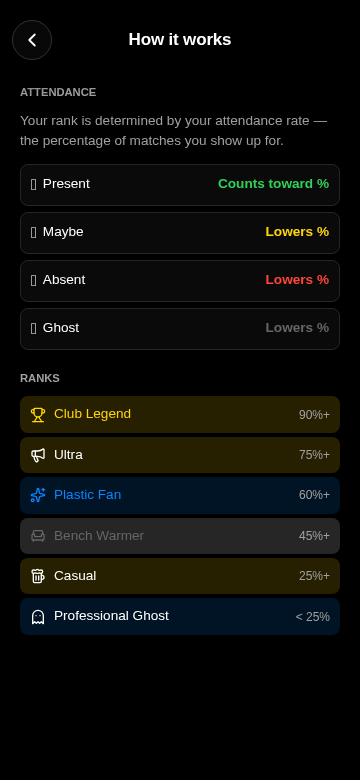

De rules-overlay legt uit hoe de percentages worden berekend. De frontend benoemt per antwoordstatus het effect op het percentage en toont vervolgens de rankdrempels: `Club Legend`, `Ultra`, `Plastic Fan`, `Bench Warmer`, `Casual` en `Professional Ghost`.

Dit scherm is bereikbaar vanuit de Stats-header en sluit via de backknop.

### 11. League — stand

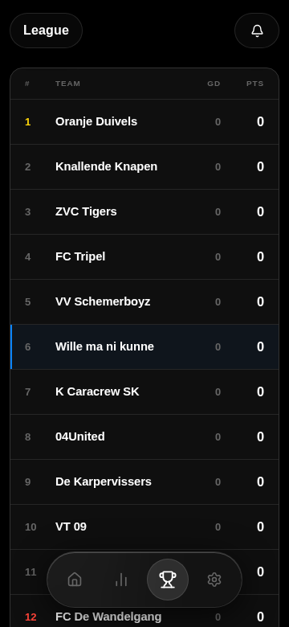

`League` toont de rangschikking van de competitie als een compacte tabel met:

- positie;
- teamnaam;
- goal difference (`GD`);
- punten (`PTS`).

Het eigen team wordt met een subtiele accentachtergrond gemarkeerd. Een tik op een team opent het teamdetail. Als meerdere competities beschikbaar zijn, verschijnt er bovenaan een league-selector; met één beschikbare competitie blijft die selector verborgen.

### 12. Team detail

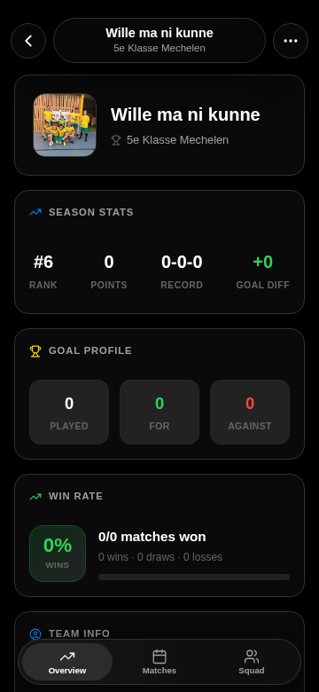

Teamdetail is een full-screen view met een header, teambeeld/naam en tabs voor `Overview`, `Matches` en `Squad`. De overview bevat onder meer:

- leaguepositie en punten;
- record en doelsaldo;
- goal profile;
- win rate;
- teaminformatie.

De backknop sluit deze view. De tabs blijven binnen hetzelfde full-screen teamdetail en wijzigen alleen de frontendcontent.

### 13. Settings

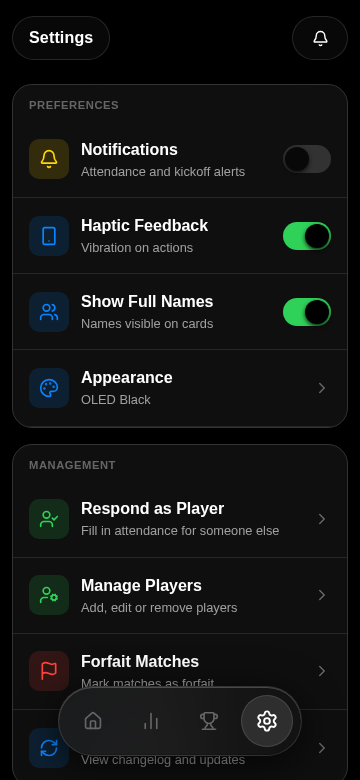

`Settings` bundelt voorkeuren, management-acties, lokale developer-informatie en sign-out.

Voor een gewone speler zijn de relevante voorkeuren:

- `Notifications`: attendance- en kick-off alerts op dit toestel;
- `Haptic Feedback`: trilling bij acties;
- `Show Full Names`: volledige namen of compactere kaartweergave;
- `Appearance`: thema kiezen.

Daarnaast bevat de view frontend-ingangen naar `Respond as Player`, `Manage Players`, `Forfait Matches` en `Version History`. Onderaan kan de speler `Sign Out` kiezen om het opgeslagen profiel te verwijderen en opnieuw het profielkeuzescherm te openen.

### 14. Appearance — theme selector

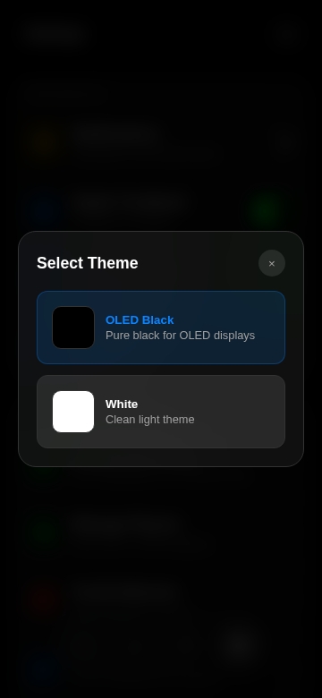

`Appearance` opent een modal met de thema’s `OLED Black` en `White`. De geselecteerde keuze wordt lokaal bijgehouden en direct op de hele app toegepast. Sluiten zonder een wijziging brengt de gebruiker terug naar Settings.

### 15. Respond as Player — speler kiezen

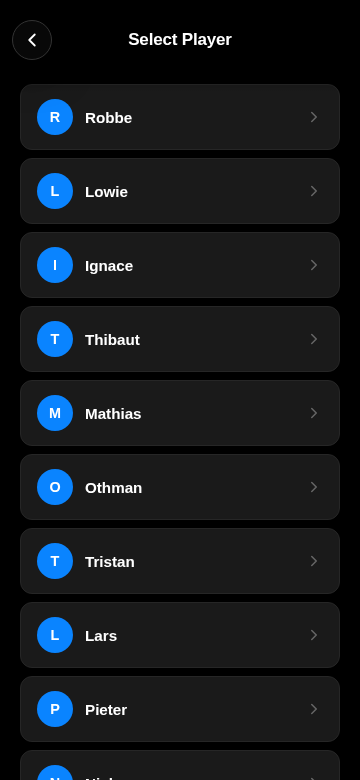

`Respond as Player` is een full-screen frontendflow in twee stappen. De eerste stap toont `Select Player` met alle spelers. Dit maakt het mogelijk dat iemand op een gedeeld toestel een antwoord voor een teamgenoot invult.

De backknop sluit de flow vanuit deze eerste stap. Een tik op een speler brengt de gebruiker naar stap twee en laadt de toekomstige matchen van die speler.

### 16. Respond as Player — aanwezigheden invullen

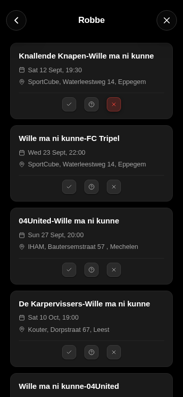

In stap twee staat de gekozen speler bovenaan, gevolgd door de komende matchkaarten. Per match kan de invuller met dezelfde drie antwoordknoppen kiezen voor:

- aanwezig;
- misschien;
- niet aanwezig.

De geselecteerde status wordt op de kaart gemarkeerd. De backknop gaat één stap terug naar `Select Player`; de sluitknop sluit de hele flow. Na een succesvolle frontendactie wordt een attendance-update-event uitgezonden zodat andere open dashboardcomponenten hun data kunnen vernieuwen.

### 17. Manage Players

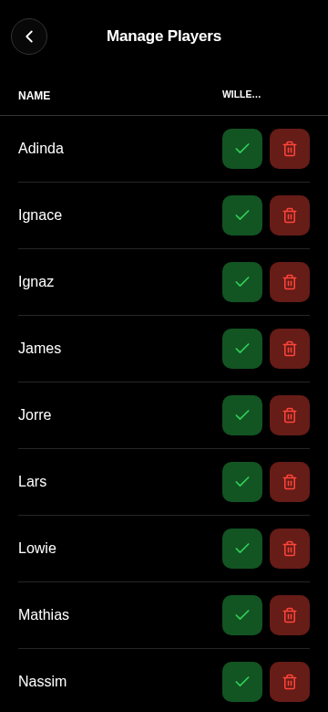

Deze view toont de spelerslijst met beheeracties per rij. De frontend biedt:

- een bestaande speler selecteren om te bewerken;
- teams koppelen of ontkoppelen;
- een speler verwijderen;
- `Add new player...`.

De view gebruikt directe feedback tijdens save-acties en heeft een backknop. In een toekomstige autorisatie-laag moet worden bepaald welke van deze acties uitsluitend aan admins worden aangeboden; in de huidige frontend is de ingang zichtbaar vanuit Settings.

### 18. Forfait Matches

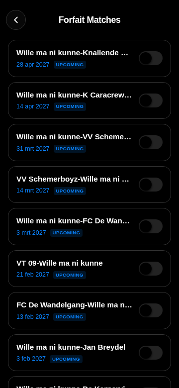

`Forfait Matches` toont wedstrijden in een scrollbare lijst met datum, statusbadge en een toggle. Een tik op een rij/toggle markeert de match als forfait of maakt die markering ongedaan. De frontend gebruikt hiervoor een duidelijke rode staat en geeft de gebruiker na de actie directe visuele feedback.

### 19. Version History

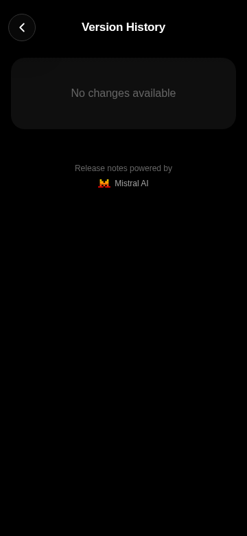

`Version History` is een full-screen changelogview. Als er geen release notes beschikbaar zijn, verschijnt `No changes available`. De view vermeldt dat release notes door Mistral AI worden gevoed en kan via de backknop worden gesloten.

## Niet opgenomen

De `Hidden Admin`-view en de unlock-flow zijn niet opgenomen, omdat deze documentatie expliciet de frontend-flow voor non-admin gebruikers beschrijft. Ook de league-selector heeft geen aparte capture: in de actuele dataset is slechts één eigen league beschikbaar, waardoor de selector niet wordt gerenderd.
